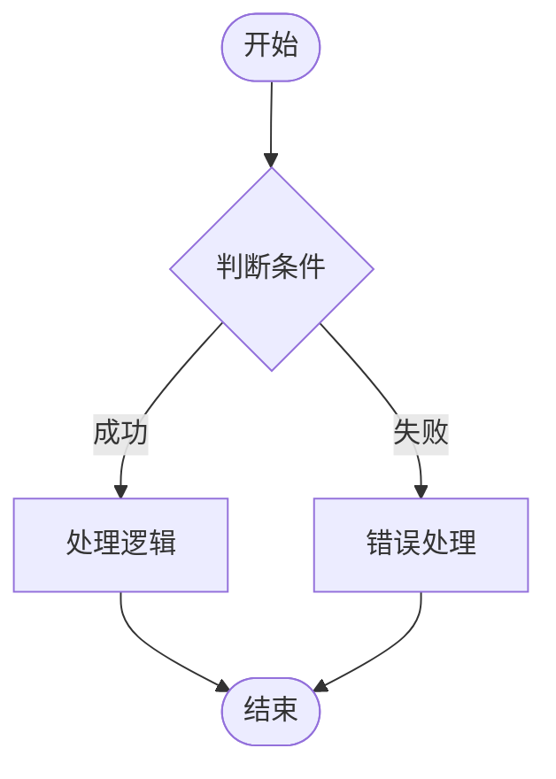
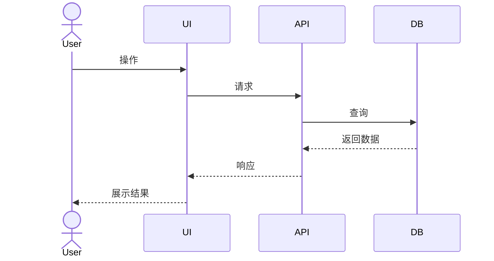
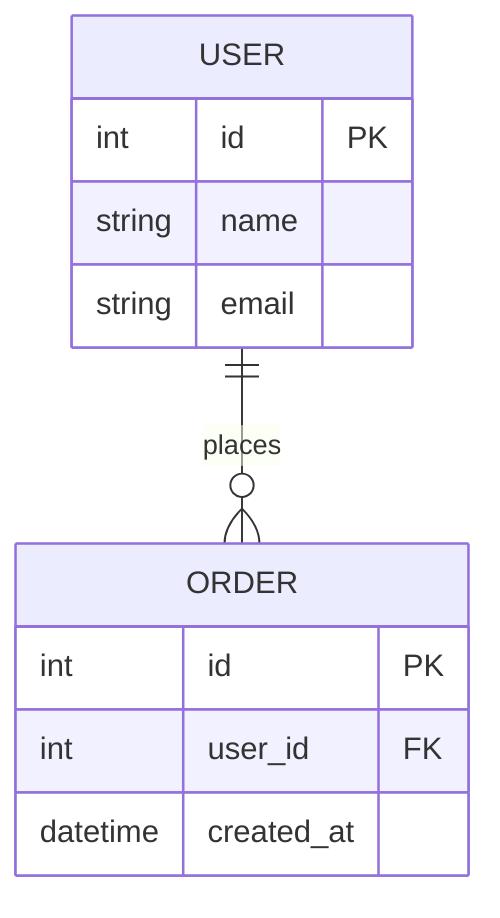

# PRD 写作规范

## 文件命名规范

| 文件 | 命名 | 说明 |
|------|------|------|
| 版本首页 | `index.md` | 版本概览 + 变更日志 |
| 项目背景 | `01-background.md` | 编号 + 英文小写 |
| 核心需求 | `02-requirements.md` | |
| 用户画像 | `03-personas.md` | |
| 用户旅程 | `04-user-journey.md` | |
| 功能模块 | `05-features/` | 目录，内含各功能文件 |
| 流程图 | `06-flows.md` | |
| 原型素材 | `07-prototype/` | 目录，存放截图 + README |
| 数据模型 | `08-data-model.md` | |
| 接口定义 | `09-api.md` | |
| 验收标准 | `10-acceptance.md` | |
| 风险评估 | `11-risk.md` | |

## Frontmatter 规范

### 版本首页

```yaml
---
version: v1.0.0
status: 草稿/评审中/已确认/已废弃/已发布
date: YYYY-MM-DD
author: 作者名
iterationGoal: 本次迭代目标（一句话）
---
```

### 功能模块

```yaml
---
featureId: F-001
module: 所属模块
priority: P0/P1/P2
status: 草稿/评审中/已确认
owner: 负责人
---
```

## 需求优先级定义

| 优先级 | 定义 | 处理原则 |
|--------|------|----------|
| P0 | 必须有 | 不做这个版本就没有意义 |
| P1 | 应该有 | 对用户体验有显著提升 |
| P2 | 可以有 | 锦上添花，可做可不做 |

## 需求 ID 规范

- **需求 ID**：R-XXX（如 R-001、R-002）
- **功能 ID**：F-XXX（如 F-001、F-002）
- **风险 ID**：Risk-XXX（如 Risk-001）

## 验收标准撰写原则

1. **可测试**：能用"是/否"判断是否通过
2. **具体**：避免模糊描述，给出具体数值或条件
3. **完整**：覆盖正常、异常、边界三种情况

**好例子：**
- ✅ 用户输入错误密码 5 次后，账号锁定 30 分钟

**坏例子：**
- ❌ 密码错误时要有提示（没有具体次数和时间）

## Mermaid 图表规范

### 流程图



### 时序图



### ER 图



## 写作风格

1. **简洁**：用最少的字表达清楚意思
2. **主动语态**："用户点击按钮" 而非 "按钮被用户点击"
3. **具体**："页面加载时间 < 2 秒" 而非 "页面加载很快"
4. **统一术语**：全文档中同一概念用同一个词
