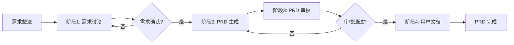

# AI 协作工作流指南

## 工作流概览



## 详细流程

### 阶段 1：需求讨论

**目标**：把模糊的想法变成清晰的需求

**步骤**：

1. 向 AI 描述你的产品想法（越详细越好）
2. AI 会提出澄清问题，帮助你思考
3. 多轮对话后，AI 输出结构化的需求要点

**Prompt 位置**：`docs/ai-prompts/01-discuss.md`

**输出**：结构化的需求要点文档

---

### 阶段 2：PRD 生成

**目标**：按模板生成完整的 PRD 文档

**步骤**：

1. 将阶段 1 的需求要点粘贴给 AI
2. AI 按章节逐个生成 PRD 内容
3. 你逐章审核，提出修改意见
4. AI 根据反馈修改

**Prompt 位置**：`docs/ai-prompts/02-generate-prd.md`

**输出**：11 个章节的完整 PRD 文件

**注意事项**：

- 要求 AI 严格遵循文件命名和 frontmatter 规范
- 每章确认后再继续下一章
- 流程图要求 AI 使用 Mermaid 语法

---

### 阶段 3：PRD 审校

**目标**：检查 PRD 质量，发现问题

**步骤**：

1. 将完整的 PRD 内容粘贴给 AI
2. AI 从完整性、一致性、可行性、质量四个维度检查
3. AI 输出问题列表和修改建议
4. 根据建议修改 PRD

**Prompt 位置**：`docs/ai-prompts/03-review-prd.md`

**输出**：审校报告

---

### 阶段 4：用户文档生成

**目标**：基于 PRD 生成用户操作说明

**步骤**：

1. 将确认的 PRD 粘贴给 AI
2. AI 生成面向用户的操作文档
3. 检查文档是否易懂

**Prompt 位置**：`docs/ai-prompts/04-generate-user-doc.md`

**输出**：`versions/vX.Y.Z/12-user-doc.md`

---

## 实际操作示例

### 使用 Claude Code（本工具）

你可以直接这样对我说：

> "我想做一个 XXX 功能，帮我进入需求讨论阶段"

我会自动加载 `00-role-prompt.md` 的角色设定和 `01-discuss.md` 的讨论模板，引导你完成需求梳理。

当你确认需求后，你可以说：

> "需求确认完毕，进入 PRD 生成阶段，版本号 v1.1.0"

我会按 `02-generate-prd.md` 的模板，为你生成完整的 PRD 各章节，并直接写入对应的文件。

### 手动使用

如果你想手动使用其他 AI 工具：

1. 打开对应的 Prompt 模板文件
2. 复制 Prompt 内容
3. 替换变量（如 `{用户输入的需求描述}`）
4. 粘贴给 AI

## Git 工作流

### 创建新版本

```bash
# 1. 从 main 切出新分支
git checkout -b prd/v1.1.0

# 2. 使用脚本创建版本目录
npm run new-version v1.1.0

# 3. 编辑版本首页信息
echo "填写版本信息..."

# 4. 与 AI 协作生成 PRD 内容
# ...

# 5. PRD 完成后提交
git add .
git commit -m "docs(prd): v1.1.0 PRD 完成"

# 6. 合并到 main
git checkout main
git merge prd/v1.1.0
```

### 分支命名

- `main`：稳定版本
- `prd/v{x}.{y}.{z}`：PRD 开发分支

### 提交规范

```
feat(prd): 新增需求 xxx
fix(prd): 修正需求 xxx 的描述
docs(prd): 更新 PRD v1.1.0
```
