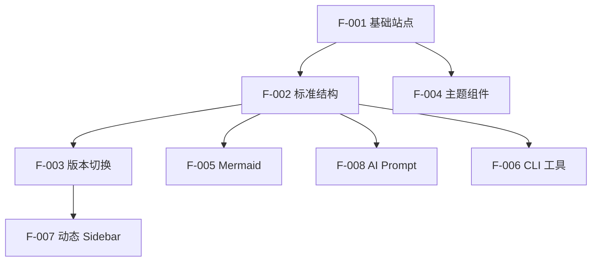

# 5. 功能模块

## 模块总览

| 功能 ID | 功能名称 | 优先级 | 状态 | 说明 |
|---------|----------|--------|------|------|
| F-001 | 基础站点搭建 | P0 | 已完成 | VitePress 项目初始化 |
| F-002 | PRD 标准结构 | P0 | 已完成 | 11 项要素目录模板 |
| F-003 | 版本切换 | P0 | 已完成 | Navbar 版本选择器 |
| F-004 | 自定义主题组件 | P1 | 已完成 | PrdMeta、StatusBadge |
| F-005 | Mermaid 图表支持 | P1 | 已完成 | 流程图渲染 |
| F-006 | CLI 工具 | P1 | 已完成 | new-version、new-feature |
| F-007 | 动态 Sidebar | P2 | 已完成 | 自动目录生成 |
| F-008 | AI Prompt 模板 | P2 | 已完成 | 4 阶段工作流 |

## 功能依赖关系

