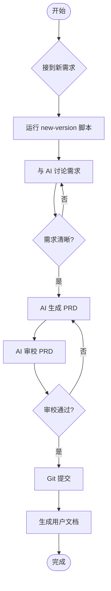
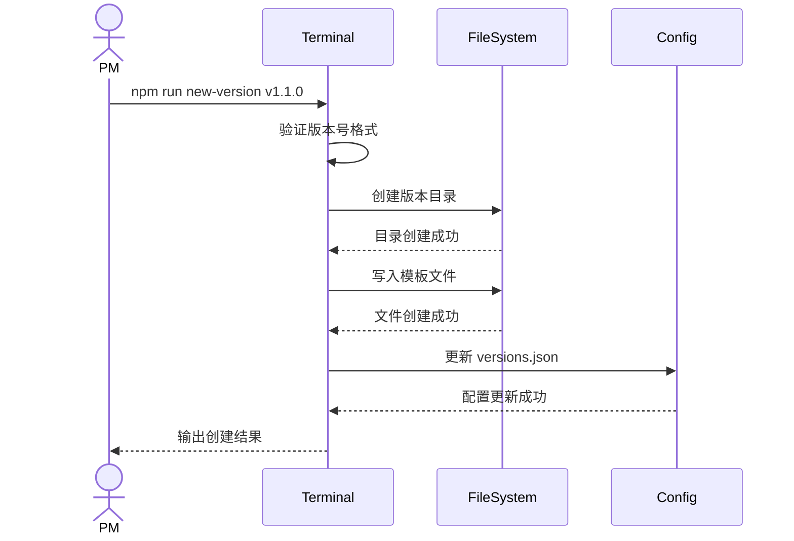
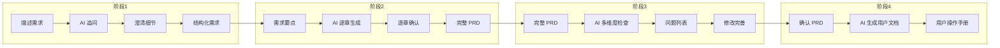
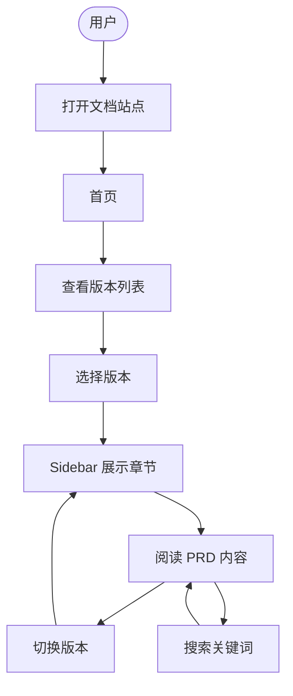

# 6. 流程图

## 整体工作流

```mermaid
graph TD
    Start([开始]) --> Need{接到新需求}
    Need --> NewVersion[运行 new-version 脚本]
    NewVersion --> Discuss[与 AI 讨论需求]
    Discuss --> Clear{需求清晰?}
    Clear -->|否| Discuss
    Clear -->|是| Generate[AI 生成 PRD]
    Generate --> Review[AI 审校 PRD]
    Review --> Pass{审校通过?}
    Pass -->|否| Generate
    Pass -->|是| Commit[Git 提交]
    Commit --> UserDoc[生成用户文档]
    UserDoc --> End([完成])
```

## 创建新版本流程

```mermaid
sequenceDiagram
    actor PM
    participant Terminal
    participant FileSystem
    participant Config

    PM->>Terminal: npm run new-version v1.1.0
    Terminal->>Terminal: 验证版本号格式
    Terminal->>FileSystem: 创建版本目录
    FileSystem-->>Terminal: 目录创建成功
    Terminal->>FileSystem: 写入模板文件
    FileSystem-->>Terminal: 文件创建成功
    Terminal->>Config: 更新 versions.json
    Config-->>Terminal: 配置更新成功
    Terminal-->>PM: 输出创建结果
```

## AI 协作流程

```mermaid
graph LR
    subgraph 阶段1
        A1[描述需求] --> A2[AI 追问]
        A2 --> A3[澄清细节]
        A3 --> A4[结构化需求]
    end

    subgraph 阶段2
        B1[需求要点] --> B2[AI 逐章生成]
        B2 --> B3[逐章确认]
        B3 --> B4[完整 PRD]
    end

    subgraph 阶段3
        C1[完整 PRD] --> C2[AI 多维度检查]
        C2 --> C3[问题列表]
        C3 --> C4[修改完善]
    end

    subgraph 阶段4
        D1[确认 PRD] --> D2[AI 生成用户文档]
        D2 --> D3[用户操作手册]
    end

    A4 --> B1
    B4 --> C1
    C4 --> D1
```

## 文档站点导航流程

```mermaid
graph TD
    User([用户]) --> Open[打开文档站点]
    Open --> Home[首页]
    Home --> VersionList[查看版本列表]
    VersionList --> SelectVersion[选择版本]
    SelectVersion --> Sidebar[Sidebar 展示章节]
    Sidebar --> Read[阅读 PRD 内容]
    Read --> SwitchVersion[切换版本]
    SwitchVersion --> Sidebar
    Read --> Search[搜索关键词]
    Search --> Read
```
