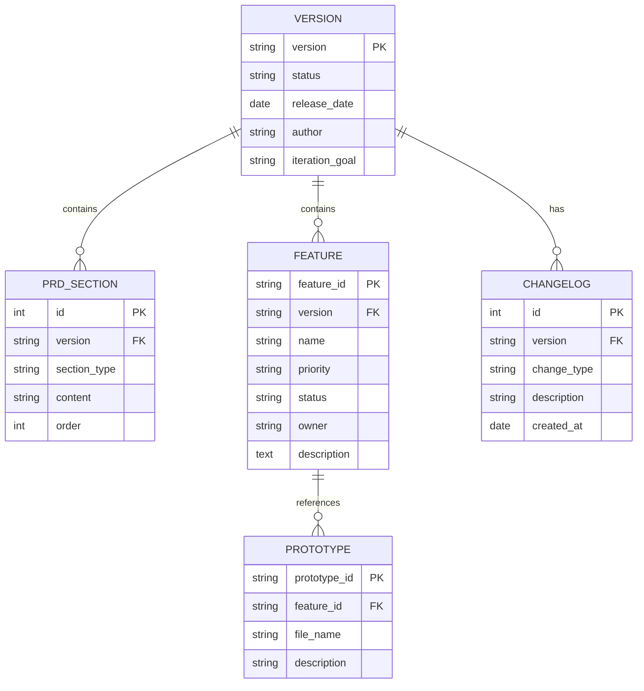

# 8. 数据模型

## 实体关系图

## 实体定义

### VERSION（版本）

| 字段 | 类型 | 必填 | 说明 |
|------|------|------|------|
| version | string | 是 | 主键，格式 vX.Y.Z |
| status | string | 是 | 状态：草稿/评审中/已确认/已发布 |
| release_date | date | 否 | 发布日期 |
| author | string | 否 | 作者 |
| iteration_goal | text | 否 | 迭代目标 |

### PRD_SECTION（PRD 章节）

| 字段 | 类型 | 必填 | 说明 |
|------|------|------|------|
| id | int | 是 | 主键 |
| version | string | 是 | 外键，关联 VERSION |
| section_type | string | 是 | 章节类型：background/requirements/... |
| content | text | 是 | Markdown 内容 |
| order | int | 是 | 排序序号 |

### FEATURE（功能模块）

| 字段 | 类型 | 必填 | 说明 |
|------|------|------|------|
| feature_id | string | 是 | 主键，格式 F-XXX |
| version | string | 是 | 外键，关联 VERSION |
| name | string | 是 | 功能名称 |
| priority | string | 是 | 优先级：P0/P1/P2 |
| status | string | 是 | 状态：草稿/评审中/已确认 |
| owner | string | 否 | 负责人 |
| description | text | 否 | 功能描述 |

### CHANGELOG（变更日志）

| 字段 | 类型 | 必填 | 说明 |
|------|------|------|------|
| id | int | 是 | 主键 |
| version | string | 是 | 外键，关联 VERSION |
| change_type | string | 是 | 类型：新增/优化/修复 |
| description | string | 是 | 变更描述 |
| created_at | date | 是 | 创建时间 |
