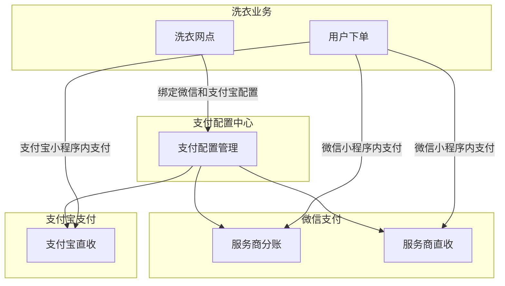

# 5. 功能模块

## 模块总览

| 功能 ID | 功能名称 | 优先级 | 状态 | 说明 |
|---------|----------|--------|------|------|
| F-101 | 短信微服务 | P0 | 草稿 | 将短信能力从快递业务拆离为独立微服务，全平台统一调用 |
| F-102 | 支付架构重构 | P0 | 草稿 | 以服务商模式为核心的收款体系，网点级支付配置管理 |

## 短信微服务依赖关系

## 支付架构重构依赖关系

