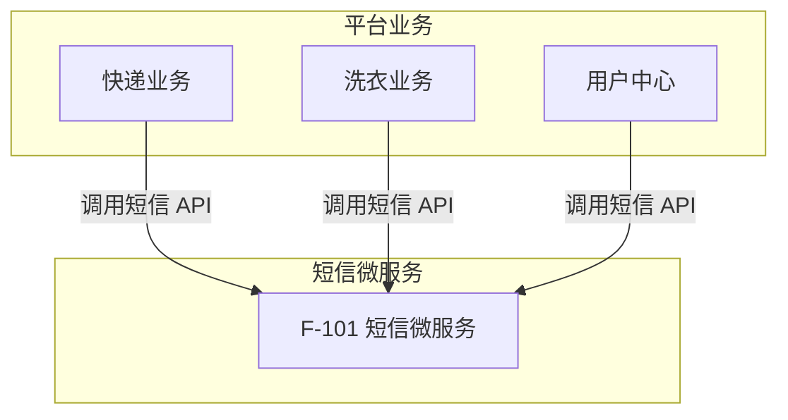
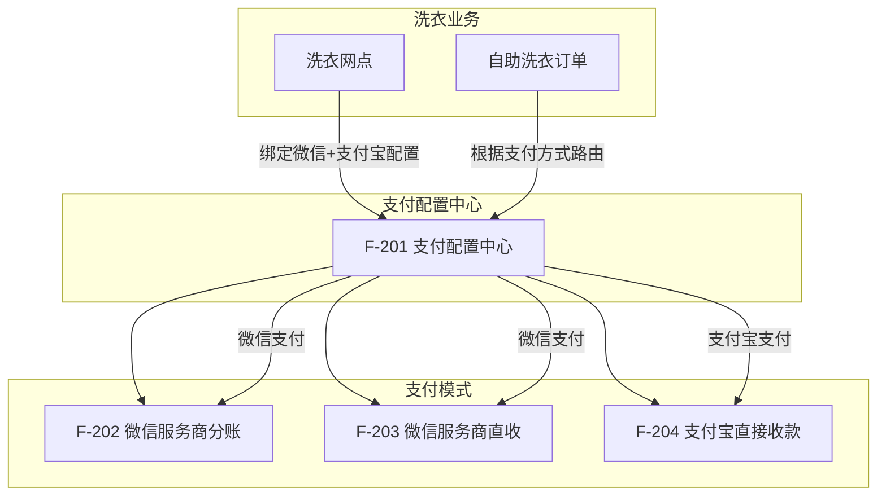

# 5. 功能模块

## 模块总览

| 功能 ID | 功能名称 | 优先级 | 状态 | 说明 |
|---------|----------|--------|------|------|
| F-101 | 短信微服务 | P0 | 草稿 | 将短信能力从快递业务拆离为独立微服务 |
| F-201 | 支付配置中心 | P0 | 草稿 | 网点级收款配置管理，支持多模式多配置 |
| F-202 | 微信服务商分账 | P0 | 草稿 | 服务商模式微信支付 + 自动分账 |
| F-203 | 微信服务商直收 | P0 | 草稿 | 服务商模式微信直接收款（不分账） |
| F-204 | 支付宝直接收款 | P1 | 草稿 | 支付宝直接收款，独立于微信支付 |

## 短信微服务依赖关系

## 支付架构依赖关系

