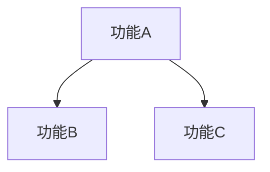

# 5. 功能模块

## 模块总览

| 功能 ID | 功能名称 | 优先级 | 状态 | 说明 |
|---------|----------|--------|------|------|
| F-001 | | P0 | 草稿 | |

## 功能依赖关系

```mermaid
graph TD
    A[功能A] --> B[功能B]
    A --> C[功能C]
```
