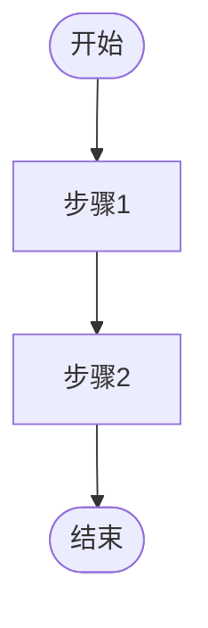
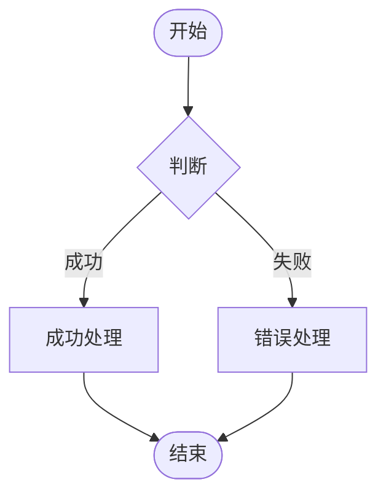

# 6. 流程图

## 主业务流程

```mermaid
graph TD
    Start([开始]) --> Step1[步骤1]
    Step1 --> Step2[步骤2]
    Step2 --> End([结束])
```

## 异常流程

```mermaid
graph TD
    Start([开始]) --> Check{判断}
    Check -->|成功| Success[成功处理]
    Check -->|失败| Error[错误处理]
    Success --> End([结束])
    Error --> End
```
