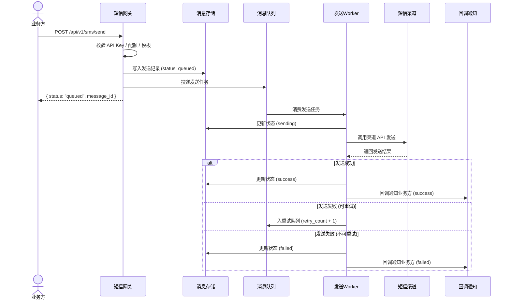
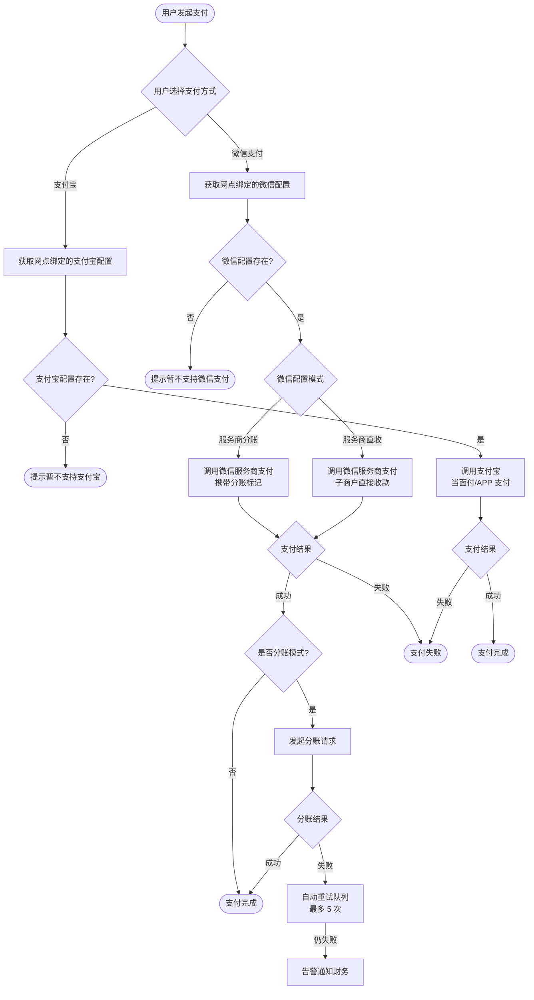
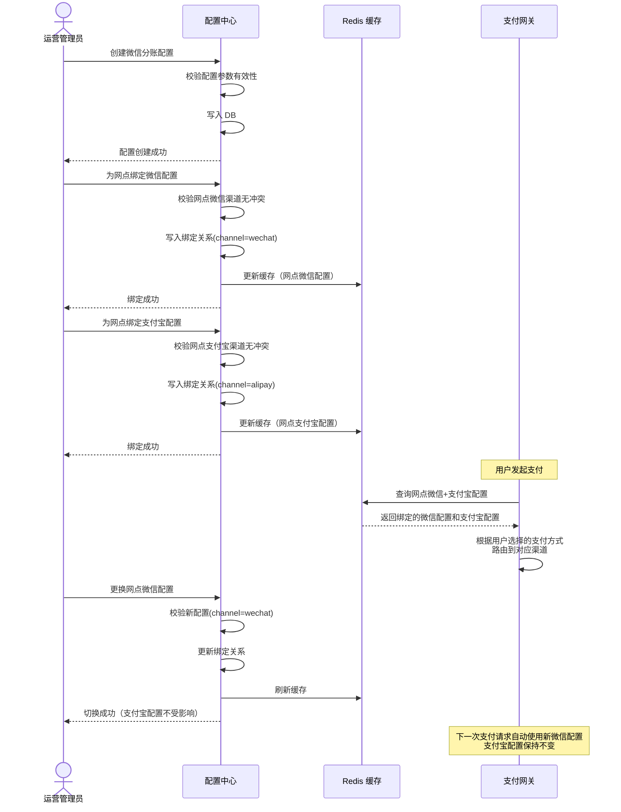
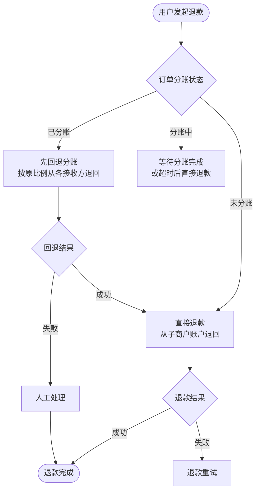

# 6. 流程图

## 短信发送全流程

```mermaid
sequenceDiagram
    actor Biz as 业务方
    participant API as 短信网关
    participant DB as 消息存储
    participant MQ as 消息队列
    participant Worker as 发送Worker
    participant Channel as 短信渠道
    participant CB as 回调通知

    Biz->>API: POST /api/v1/sms/send
    API->>API: 校验 API Key / 配额 / 模板
    API->>DB: 写入发送记录 (status: queued)
    API->>MQ: 投递发送任务
    API-->>Biz: { status: "queued", message_id }

    MQ->>Worker: 消费发送任务
    Worker->>DB: 更新状态 (sending)
    Worker->>Channel: 调用渠道 API 发送
    Channel-->>Worker: 返回发送结果

    alt 发送成功
        Worker->>DB: 更新状态 (success)
        Worker->>CB: 回调通知业务方 (success)
    else 发送失败 (可重试)
        Worker->>MQ: 入重试队列 (retry_count + 1)
    else 发送失败 (不可重试)
        Worker->>DB: 更新状态 (failed)
        Worker->>CB: 回调通知业务方 (failed)
    end
```

## 支付模式选择流程

```mermaid
graph TD
    Start([用户发起支付]) --> UserChoice{用户选择支付方式}

    UserChoice -->|微信支付| GetWxConfig[获取网点绑定的微信配置]
    UserChoice -->|支付宝| GetAliConfig[获取网点绑定的支付宝配置]

    GetAliConfig --> AliCheck{支付宝配置存在?}
    AliCheck -->|否| PayFail([提示暂不支持支付宝])
    AliCheck -->|是| AliPay[调用支付宝<br/>当面付/APP 支付]

    GetWxConfig --> WxCheck{微信配置存在?}
    WxCheck -->|否| PayFailWx([提示暂不支持微信支付])
    WxCheck -->|是| WxModeSwitch{微信配置模式}

    WxModeSwitch -->|服务商分账| WxSplitPay[调用微信服务商支付<br/>携带分账标记]
    WxModeSwitch -->|服务商直收| WxDirectPay[调用微信服务商支付<br/>子商户直接收款]

    WxSplitPay --> PayResult{支付结果}
    WxDirectPay --> PayResult
    AliPay --> AliPayResult{支付结果}

    PayResult -->|成功| ProfitCheck{是否分账模式?}
    PayResult -->|失败| FailEnd([支付失败])
    AliPayResult -->|成功| SuccessEndAli([支付完成])
    AliPayResult -->|失败| FailEnd

    ProfitCheck -->|是| DoSplit[发起分账请求]
    ProfitCheck -->|否| SuccessEnd([支付完成])

    DoSplit --> SplitResult{分账结果}
    SplitResult -->|成功| SuccessEnd
    SplitResult -->|失败| RetrySplit[自动重试队列<br/>最多 5 次]
    RetrySplit -->|仍失败| Alert[告警通知财务]
```

## 支付配置绑定与切换流程

```mermaid
sequenceDiagram
    actor Admin as 运营管理员
    participant Backend as 配置中心
    participant Redis as Redis 缓存
    participant PayGW as 支付网关

    Admin->>Backend: 创建微信分账配置
    Backend->>Backend: 校验配置参数有效性
    Backend->>Backend: 写入 DB
    Backend-->>Admin: 配置创建成功

    Admin->>Backend: 为网点绑定微信配置
    Backend->>Backend: 校验网点微信渠道无冲突
    Backend->>Backend: 写入绑定关系(channel=wechat)
    Backend->>Redis: 更新缓存（网点微信配置）
    Backend-->>Admin: 绑定成功

    Admin->>Backend: 为网点绑定支付宝配置
    Backend->>Backend: 校验网点支付宝渠道无冲突
    Backend->>Backend: 写入绑定关系(channel=alipay)
    Backend->>Redis: 更新缓存（网点支付宝配置）
    Backend-->>Admin: 绑定成功

    Note over PayGW: 用户发起支付

    PayGW->>Redis: 查询网点微信+支付宝配置
    Redis-->>PayGW: 返回绑定的微信配置和支付宝配置
    PayGW->>PayGW: 根据用户选择的支付方式<br/>路由到对应渠道

    Admin->>Backend: 更换网点微信配置
    Backend->>Backend: 校验新配置(channel=wechat)
    Backend->>Backend: 更新绑定关系
    Backend->>Redis: 刷新缓存
    Backend-->>Admin: 切换成功（支付宝配置不受影响）

    Note over PayGW: 下一次支付请求自动使用新微信配置<br/>支付宝配置保持不变
```

## 服务商分账回退流程

```mermaid
graph TD
    Refund([用户发起退款]) --> CheckStatus{订单分账状态}
    CheckStatus -->|未分账| DirectRefund[直接退款<br/>从子商户账户退回]
    CheckStatus -->|已分账| SplitBack[先回退分账<br/>按原比例从各接收方退回]
    CheckStatus -->|分账中| WaitSplit[等待分账完成<br/>或超时后直接退款]

    SplitBack --> SplitBackResult{回退结果}
    SplitBackResult -->|成功| DirectRefund
    SplitBackResult -->|失败| ManualHandle[人工处理]

    DirectRefund --> RefundResult{退款结果}
    RefundResult -->|成功| Done([退款完成])
    RefundResult -->|失败| RefundRetry[退款重试]
    ManualHandle --> Done
```
