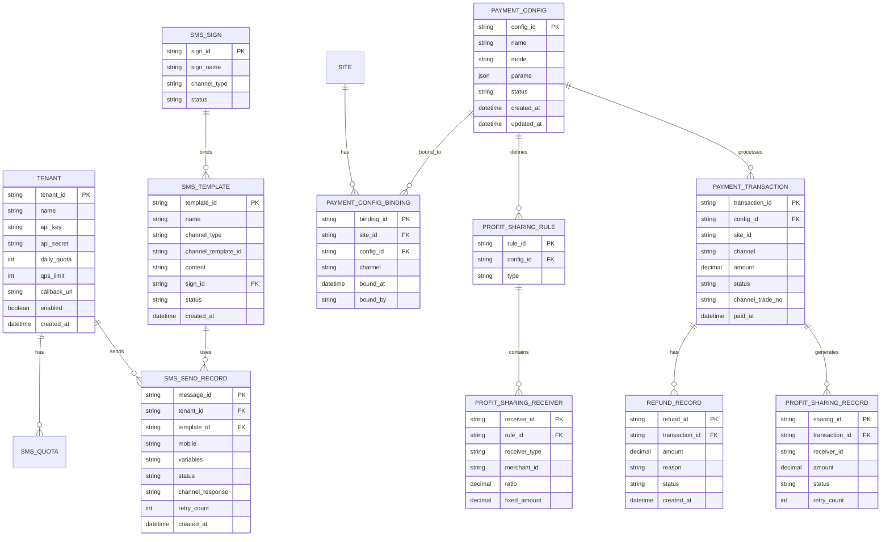

# 8. 数据模型

## 实体关系图



## 核心实体定义

### SMS_TENANT（短信租户）

| 字段 | 类型 | 必填 | 说明 |
|------|------|------|------|
| tenant_id | string(32) | 是 | 主键，租户唯一标识 |
| name | string(64) | 是 | 租户名称，如「快递业务」「洗衣业务」 |
| api_key | string(64) | 是 | API 密钥，用于鉴权 |
| api_secret | string(128) | 是 | API 密钥 Secret，加密存储 |
| daily_quota | int | 是 | 日发送配额（条），默认 5000 |
| qps_limit | int | 是 | 每秒发送速率上限，默认 50 |
| callback_url | string(256) | 否 | 默认回调地址 |
| enabled | boolean | 是 | 是否启用 |

### SMS_SEND_RECORD（短信发送记录）

| 字段 | 类型 | 必填 | 说明 |
|------|------|------|------|
| message_id | string(32) | 是 | 主键，消息唯一标识 |
| tenant_id | string(32) | 是 | 外键，关联租户 |
| template_id | string(32) | 是 | 外键，关联模板 |
| mobile | string(20) | 是 | 接收手机号 |
| variables | json | 否 | 模板变量值 |
| status | enum | 是 | queued/sending/success/failed |
| channel_response | json | 否 | 渠道返回原始数据 |
| retry_count | int | 否 | 重试次数 |

### SMS_TEMPLATE（短信模板）

| 字段 | 类型 | 必填 | 说明 |
|------|------|------|------|
| template_id | string(32) | 是 | 主键 |
| name | string(64) | 是 | 模板名称 |
| channel_type | enum | 是 | 渠道：aliyun/tencent |
| channel_template_id | string(64) | 是 | 渠道侧的模板 ID |
| content | string(512) | 是 | 模板内容，`{var}` 为变量占位符 |
| sign_id | string(32) | 是 | 外键，关联签名 |
| status | enum | 是 | draft/pending_review/enabled/disabled |

### SMS_SIGN（短信签名）

| 字段 | 类型 | 必填 | 说明 |
|------|------|------|------|
| sign_id | string(32) | 是 | 主键 |
| sign_name | string(32) | 是 | 签名内容，如「XX科技」 |
| channel_type | enum | 是 | 渠道：aliyun/tencent |
| status | enum | 是 | enabled/disabled |

### PAYMENT_CONFIG（支付配置）

| 字段 | 类型 | 必填 | 说明 |
|------|------|------|------|
| config_id | string(32) | 是 | 主键 |
| name | string(64) | 是 | 配置名称，全平台唯一 |
| mode | enum | 是 | 模式：wechat_split/wechat_direct/alipay_direct |
| params | json | 是 | 模式对应的配置参数 |
| status | enum | 是 | enabled/disabled |

**params 字段 Schema（按模式）：**

微信服务商分账模式：
```json
{
  "service_mch_id": "服务商商户号",
  "api_key": "API密钥",
  "sub_mch_id": "子商户号",
  "profit_sharing": { "enabled": true, "rule_id": "..." }
}
```

微信服务商直收模式：
```json
{
  "service_mch_id": "服务商商户号",
  "api_key": "API密钥",
  "sub_mch_id": "子商户号",
  "notify_url": "支付回调地址"
}
```

支付宝直收模式：
```json
{
  "app_id": "支付宝应用ID",
  "merchant_pid": "商户PID",
  "alipay_public_key": "支付宝公钥",
  "merchant_private_key": "商户私钥（加密存储）",
  "notify_url": "异步通知地址"
}
```

### PAYMENT_CONFIG_BINDING（支付配置绑定）

| 字段 | 类型 | 必填 | 说明 |
|------|------|------|------|
| binding_id | string(32) | 是 | 主键 |
| site_id | string(32) | 是 | 外键，洗衣网点 ID |
| config_id | string(32) | 是 | 外键，关联支付配置 |
| channel | enum | 是 | 支付渠道：wechat / alipay |
| bound_at | datetime | 是 | 绑定时间 |
| bound_by | string(32) | 是 | 操作人 |

**唯一约束：** `site_id + channel` 联合唯一。同一网点同一渠道只能有一个绑定。即一个网点最多存在一条 `channel=wechat` 的记录和一条 `channel=alipay` 的记录。

### PROFIT_SHARING_RULE（分账规则）

| 字段 | 类型 | 必填 | 说明 |
|------|------|------|------|
| rule_id | string(32) | 是 | 主键 |
| config_id | string(32) | 是 | 外键，关联支付配置 |
| type | enum | 是 | ratio（按比例） / fixed（按固定金额） |

### PROFIT_SHARING_RECEIVER（分账接收方）

| 字段 | 类型 | 必填 | 说明 |
|------|------|------|------|
| receiver_id | string(32) | 是 | 主键 |
| rule_id | string(32) | 是 | 外键，关联分账规则 |
| receiver_type | enum | 是 | platform/franchisee/supplier/other |
| merchant_id | string(64) | 是 | 微信商户号 |
| ratio | decimal(5,4) | 否 | 分账比例（type=ratio 时必填） |
| fixed_amount | decimal(10,2) | 否 | 固定金额（type=fixed 时必填） |

### PAYMENT_TRANSACTION（支付交易）

| 字段 | 类型 | 必填 | 说明 |
|------|------|------|------|
| transaction_id | string(32) | 是 | 主键，内部交易号 |
| config_id | string(32) | 是 | 外键，使用的支付配置 |
| site_id | string(32) | 是 | 洗衣网点 ID |
| channel | enum | 是 | 支付渠道：wechat/alipay |
| amount | decimal(10,2) | 是 | 支付金额（元） |
| status | enum | 是 | pending/success/failed/refunded |
| channel_trade_no | string(64) | 否 | 渠道侧交易号 |
| paid_at | datetime | 否 | 支付成功时间 |

### PROFIT_SHARING_RECORD（分账记录）

| 字段 | 类型 | 必填 | 说明 |
|------|------|------|------|
| sharing_id | string(32) | 是 | 主键 |
| transaction_id | string(32) | 是 | 外键，关联交易 |
| receiver_id | string(32) | 是 | 分账接收方 ID |
| amount | decimal(10,2) | 是 | 分账金额 |
| status | enum | 是 | pending/processing/success/failed/reversed |
| retry_count | int | 否 | 重试次数 |

### REFUND_RECORD（退款记录）

| 字段 | 类型 | 必填 | 说明 |
|------|------|------|------|
| refund_id | string(32) | 是 | 主键 |
| transaction_id | string(32) | 是 | 外键，关联交易 |
| amount | decimal(10,2) | 是 | 退款金额 |
| reason | string(256) | 否 | 退款原因 |
| status | enum | 是 | processing/success/failed |
| created_at | datetime | 是 | 退款申请时间 |
