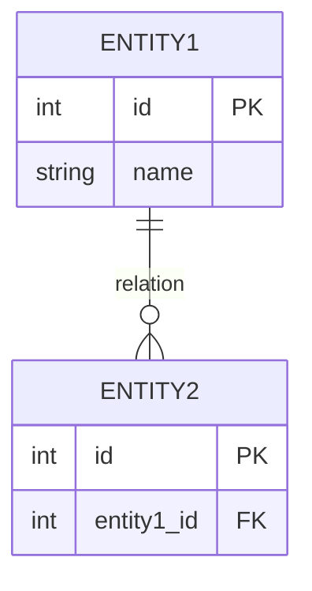

# 8. 数据模型

## 实体关系图

```mermaid
erDiagram
    ENTITY1 ||--o{ ENTITY2 : relation
    ENTITY1 {
        int id PK
        string name
    }
    ENTITY2 {
        int id PK
        int entity1_id FK
    }
```

## 实体定义

### 实体 1

| 字段 | 类型 | 必填 | 说明 |
|------|------|------|------|
| id | int | 是 | 主键 |
